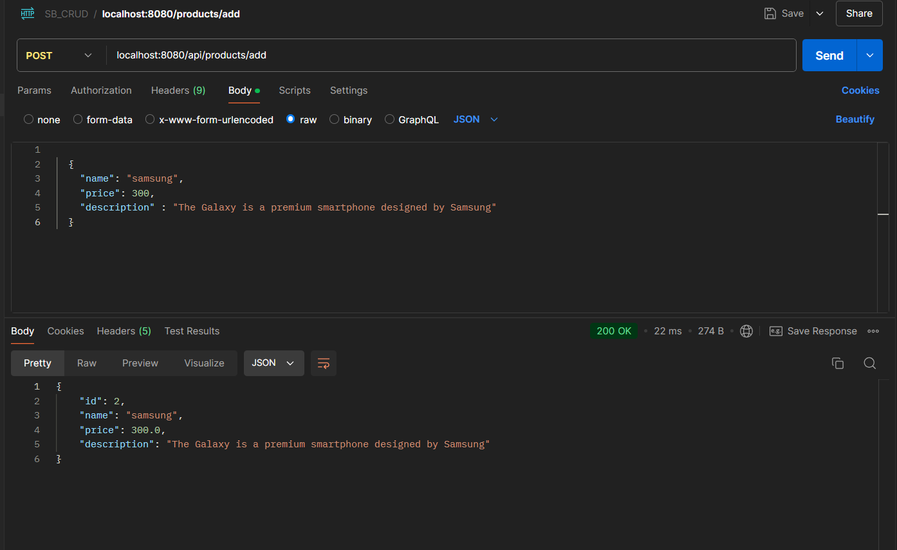
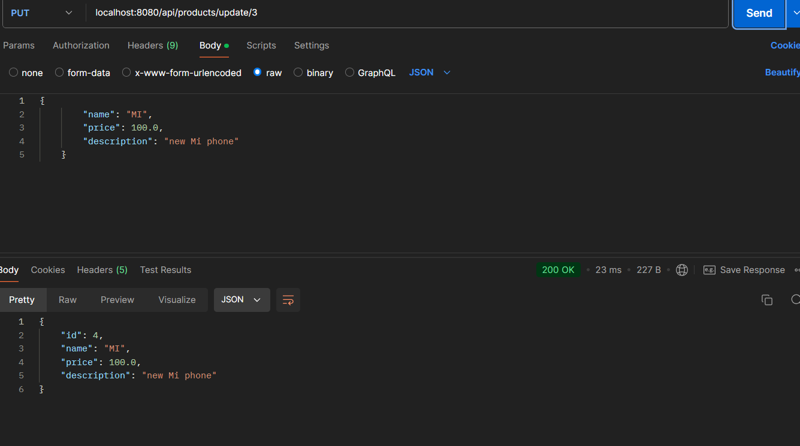

# CRUD Application using Spring Boot

## Table of Contents
- [Introduction](#introduction)
- [Features](#features)
- [Technologies Used](#technologies-used)
- [Setup Instructions](#setup-instructions)
- [Usage](#usage)
- [API Endpoints](#api-endpoints)
- [Database Schema](#database-schema)
- [Future Improvements](#future-improvements)
- [Contributing](#contributing)
- [License](#license)

## Introduction

This project is a simple CRUD (Create, Read, Update, Delete) application built with **Spring Boot**. It demonstrates how to implement a RESTful API with basic CRUD operations, making it a great starting point for understanding core Spring Boot concepts and backend development.

## Features
- Create new entries (e.g., users, products, etc.)
- Read (view) existing entries
- Update existing entries
- Delete entries
- Error handling and validation

## Technologies Used
- **Java**: The core programming language used.
- **Spring Boot**: A framework that simplifies building Java web applications.
- **Spring Data JPA**: To handle data persistence.
- **MySQL**: The database used for storing data (specify your choice).
- **Maven**: Dependency management and build tool.
- **Lombok**: For reducing boilerplate code.

## Setup Instructions

### Prerequisites
- Java 8 or later installed on your machine.
- Maven installed.
- A database (using a local MySQL).

### Steps to Run Locally

1. **Clone the repository**:
    ```bash
    git clone https://github.com/your-repo/crud-app.git
    cd crud-app
    ```

2. **Configure the database** (optional, if using an external database):
    - Update the `application.properties` or `application.yml` file with your database credentials:
      ```properties
      spring.datasource.url=jdbc:mysql://localhost:3306/sb_demo_db
      spring.datasource.username=your-username
      spring.datasource.password=your-password
      ```

3. **Build the project**:
    ```bash
    mvn clean install
    ```

4. **Run the application**:
    ```bash
    mvn spring-boot:run
    ```

5. **Access the application**:
    - API: `http://localhost:8080/products/all`

## Usage

Once the application is up and running, you can use tools like **Postman** or **curl** to test the CRUD operations on the provided API endpoints.

## API Endpoints

| Method | Endpoint             | Description               |
|--------|----------------------|---------------------------|
| GET    | `/api/products/all`  | Get all products          |
| GET    | `/api/products/{id}` | Get entity by ID          |
| POST   | `/api/add`           | Create a new entity       |
| PUT    | `/api/update/{id}`   | Update an existing entity |
| DELETE | `/api/delete/{id}`   | Delete an entity          |


## Database Schema

If you're using a relational database like MySQL, you can include a brief description of the table schema here.

Example:
```sql
create table product (
    price float(53) not null, 
    id bigint not null auto_increment, 
    description varchar(255), 
    name varchar(255), 
    primary key (id)
);
```

## Future Improvements
- Add authentication and authorization using Spring Security.
- Implement pagination and sorting for the data.
- Migrate to a microservices architecture.
- Enhance error handling and logging.


## Images of Postman Doing CRUD operations


### Create Operation


### Read Operation


### Read Operation By Id


### Update Operation


### Delete Operation


## Contributing

Contributions are welcome! If you have any improvements or suggestions, feel free to submit a pull request.

---

